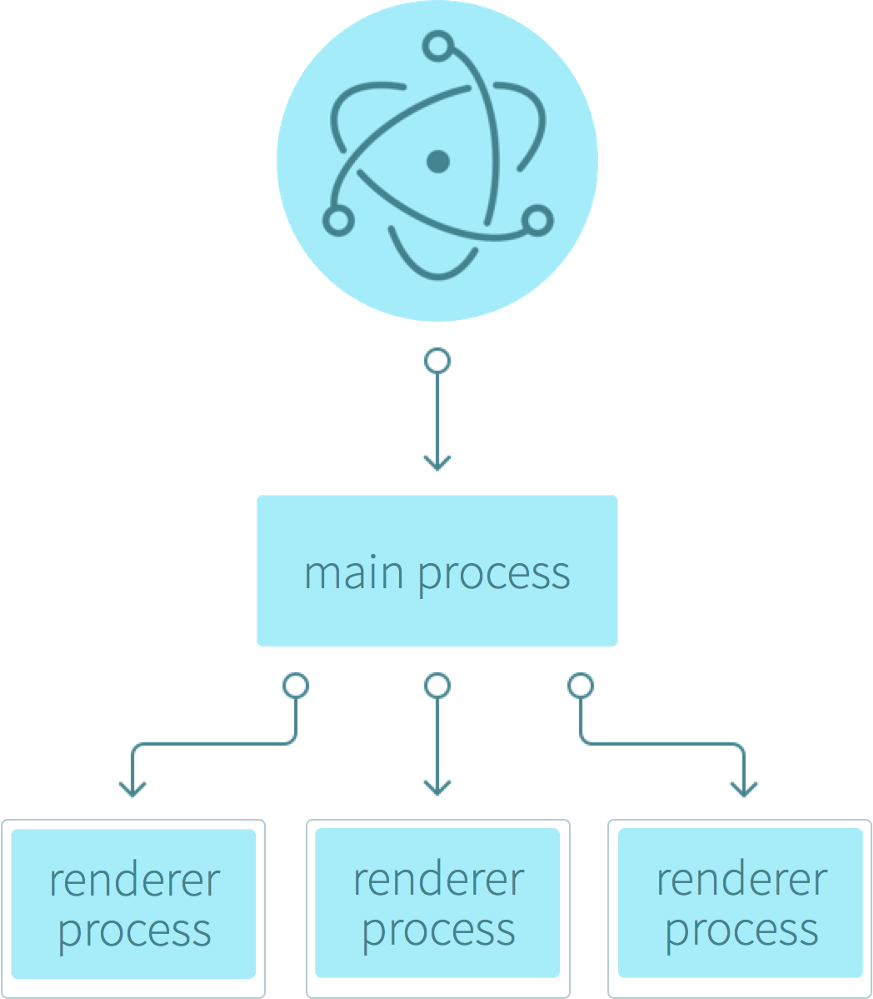

# Electron

> 使用 JavaScript, HTML 和 CSS 构建跨平台的桌面应用

> **`Electron`** 为用纯 `JavaScript` 创建桌面应用提供了 **`运行时`**。原理是，Electron调用你在 **`package.json`** 中定义的 `main` 文件并执行它。main文件（通常被命名为main.js）会创建一个内含渲染完的web页面的应用窗口，并添加与你操作系统的原生GUI（图形界面）交互的功能。

> 详细地说，当用Electron启动一个应用，会创建一个主进程。这个主进程负责与你系统原生的GUI进行交互并为你的应用创建GUI（在你的应用窗口）

 
 

—— 《用 Electron 开发桌面应用》

## Examples

- [hello-world](#)
- [electron-react](#)
- [electron-react-ui](#)

## Others

- [electron-react-boilerplate](https://github.com/electron-react-boilerplate/electron-react-boilerplate) : 

## References

- [官网](https://electronjs.org/)
- [中文网](https://electron.org.cn/)

#### Articles

- [用 Electron 开发桌面应用](http://get.ftqq.com/7870.get)
- [Electron + React + Node.js + ES6 开发桌面软件](https://blog.csdn.net/mingzznet/article/details/53512475)