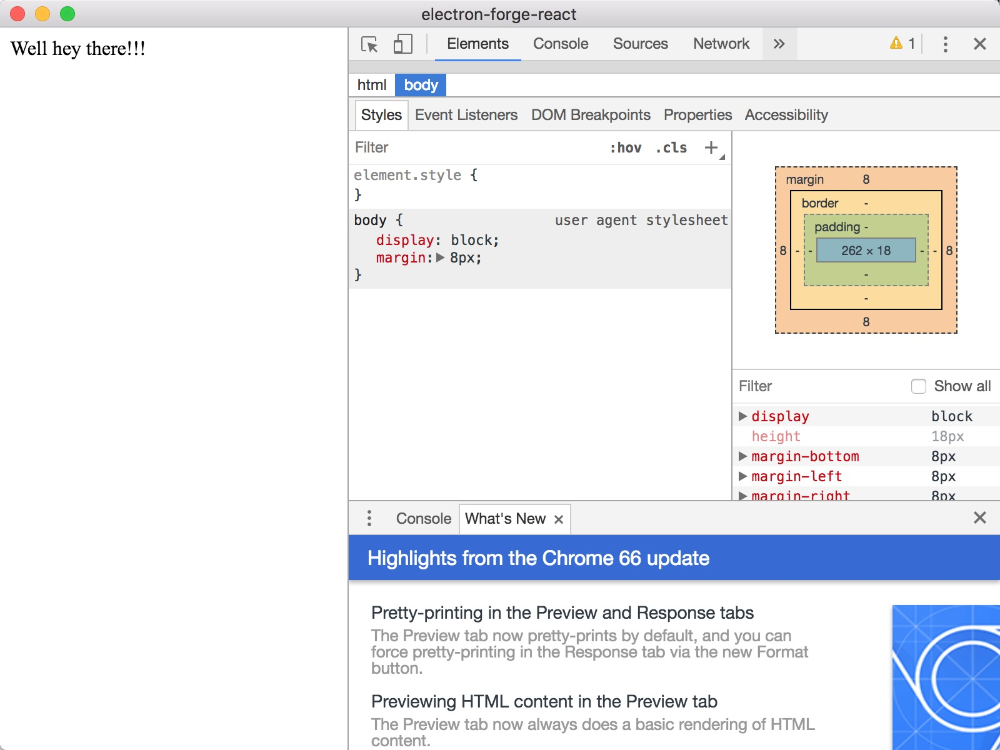
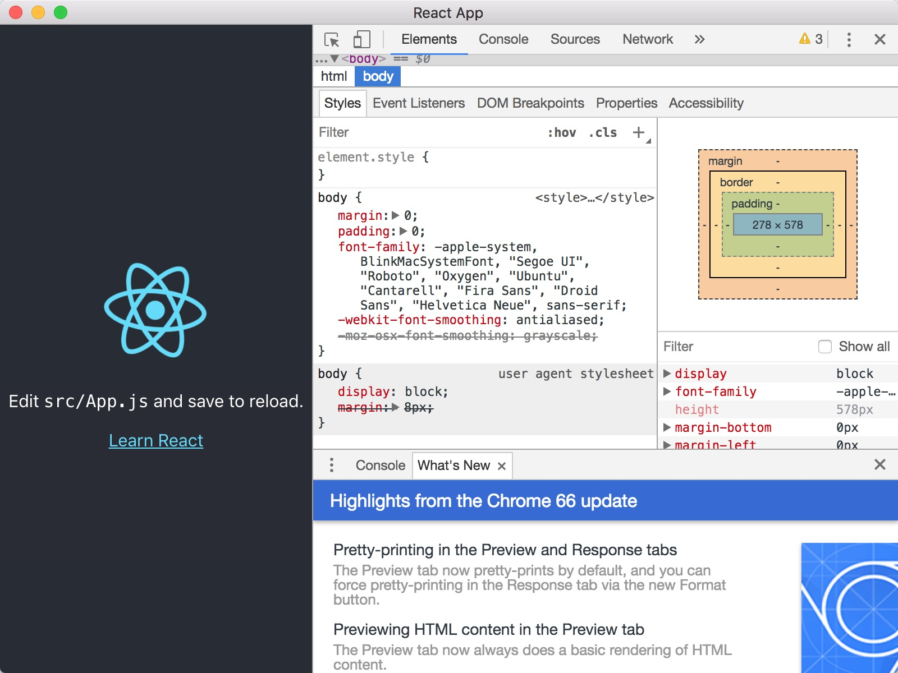

# Electron with Electron-forge and React

## 环境搭建步骤

#### 1. 全局安装 electron-forge

```bash
npm install -g electron-forge
```

#### 2. 初始化项目

初始化的时候可以指定框架模板 `React`、`Vue`、`Angular`，尝试之后发现很鸡肋，还是一步步配置吧😅 !

- [electron-forge-templates](https://github.com/electron-userland/electron-forge-templates)

```bash
electron-forge init electron-forge-react # --template=react 指定使用React模板
```

#### 3. 检查启动

```bash
npm start
```



#### 4. 添加 React

> 这一步可以参考 `electron-react`，通过 `create-react-app` 初始化一个 React 项目，主要是他有完整的 `webpack` 构建，不需要手动配置

##### 4.1 添加依赖

```bash
npm install -S react react-dom react-scripts
```

##### 4.2 添加命令脚本

- package.json

```
"scripts": {
  "react:start": "react-scripts start",
  "react:build": "react-scripts build",
},
```

#### 4.3 更新eslint

- package.json

```
"eslint": "^5.6.0",
```

> `electron-forge` 下的 *eslint* 版本和 `create-react-app` 版本有冲突，因此做出修改.

#### 4.4 添加依赖

```bash
npm install concurrently wait-on cross-env -D
```

#### 4.5 添加启动命令

- package.json

```
"electron-dev": "concurrently \"cross-env BROWSER=none npm run react:start\" \"wait-on http://localhost:3000 && npm start\""
```

> `npm start` 命令对应执行的是 *`electron-forge start`*，更详细解析查看 `electron-react`

#### 5. 修改代码

> 添加 React 相关代码

##### 5.1 修改入口
- package.json

```
"main": "main.js",
```

##### 5.2 修改页面和JS

> 直接拷贝 `create-react-app` 初始化项目下的 `public` 和 `src` 到项目中，（详细查看项目代码）

#### 6. 启动

```bash
npm run electron-dev
```



## 添加开发调试工具

> 参考 `hello-world` 和 `electron-react-ui`