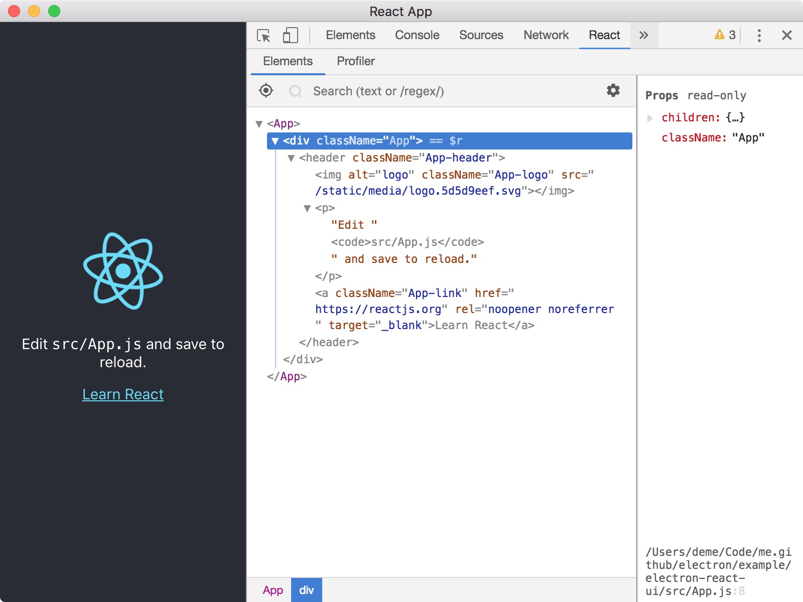
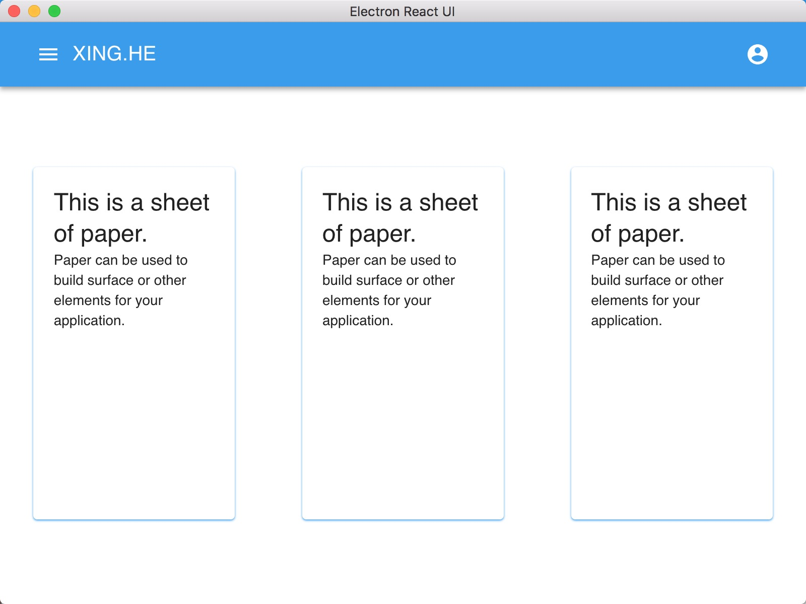

# Electron with React and Material-ui

## 环境搭建步骤

> 基于 `electron-react` 添加 [**material-ui**](https://github.com/mui-org/material-ui)

#### 1. 添加 electron-debug

```js
yarn add electron-debug devtron electron-devtools-installer -D
```

#### 2. 启动

```bash
yarn electron-dev
```



#### 3. 添加UI依赖

```bash
yarn add @material-ui/core @material-ui/icons
```

#### 4. 修改页面

> 查看代码

