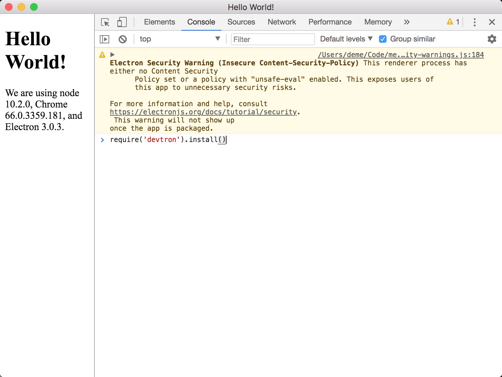
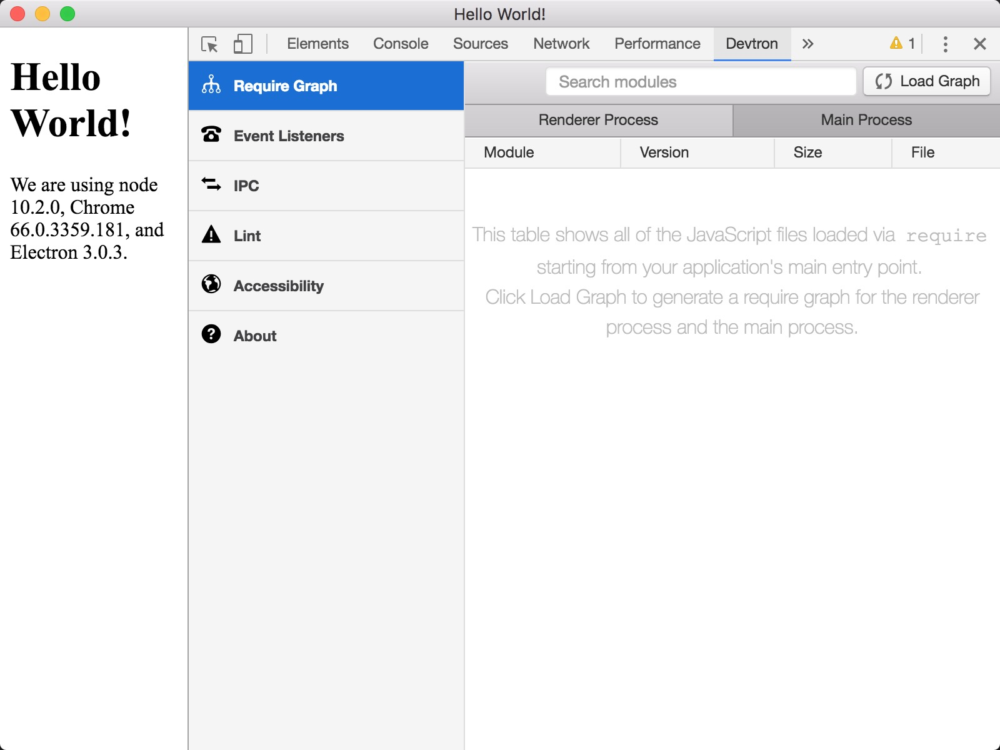

# Electron, Hello World!

## 搭建步骤

#### 1. 初始化项目

```bash
$ mkdir hello-world
$ cd hello-world && npm init
```

#### 2. 安装依赖

```bash
$ npm install electron -D
```

#### 3. 新建入口文件

- main.js

```js
const { app, BrowserWindow } = require('electron')

// Keep a global reference of the window object, if you don't, the window will
// be closed automatically when the JavaScript object is garbage collected.
let win

function createWindow() {
  // 创建浏览器窗口。
  win = new BrowserWindow({ width: 800, height: 600 })

  // 然后加载应用的 index.html。
  win.loadFile('index.html')

  // 打开开发者工具
  win.webContents.openDevTools()

  // 当 window 被关闭，这个事件会被触发。
  win.on('closed', () => {
    // 取消引用 window 对象，如果你的应用支持多窗口的话，
    // 通常会把多个 window 对象存放在一个数组里面，
    // 与此同时，你应该删除相应的元素。
    win = null
  })
}

// Electron 会在初始化后并准备
// 创建浏览器窗口时，调用这个函数。
// 部分 API 在 ready 事件触发后才能使用。
app.on('ready', createWindow)

// 当全部窗口关闭时退出。
app.on('window-all-closed', () => {
  // 在 macOS 上，除非用户用 Cmd + Q 确定地退出，
  // 否则绝大部分应用及其菜单栏会保持激活。
  if (process.platform !== 'darwin') {
    app.quit()
  }
})

app.on('activate', () => {
  // 在macOS上，当单击dock图标并且没有其他窗口打开时，
  // 通常在应用程序中重新创建一个窗口。
  if (win === null) {
    createWindow()
  }
})

// 在这个文件中，你可以续写应用剩下主进程代码。
// 也可以拆分成几个文件，然后用 require 导入。
```

##### 3.1 修改入口地址

- package.json

```json
"main": "main.js"
```

#### 4. 新建页面

- index.html

```html
<!DOCTYPE html>
<html>

<head>
  <meta charset="UTF-8">
  <title>Hello World!</title>
</head>

<body>
  <h1>Hello World!</h1>
  We are using node
  <script>document.write(process.versions.node)</script>, Chrome
  <script>document.write(process.versions.chrome)</script>, and Electron
  <script>document.write(process.versions.electron)</script>.
</body>

</html>
```

#### 5. 配置启动命令

- package.json

```json
"scripts": {
  "start": "electron ."
}
```

#### 6. 启动

```bash
npm start
```

## 添加开发调试工具 `devtron`

#### 1. 安装依赖

```bash
npm install devtron -D
```

#### 2. 启用调试工具

> 启动调试工具的方式有两种:


##### 2.1 在应用 `Ready` 之后添加代码 `require('devtron').install()`，启用开发者工具

- main.js

```js
// 开启 devtron 调试工具
require('devtron').install();
```

##### 2.2 在应用启动后的 `开发者选项` 中的 控制台 (`Console`)，输入代码 `require('devtron').install()` 启用工具




## 调试工具包

### [electron-debug](https://github.com/sindresorhus/electron-debug)

> 该调试工具库中包含了一些常用的调试工具 `devtron` `react`，并添加了一些调试快捷键，`源码` 如下：

```js
app.on('ready', () => {
  addExtensionIfInstalled('devtron', name => require(name).path);
  addExtensionIfInstalled('electron-react-devtools', name => require(name).path);

  localShortcut.register('CmdOrCtrl+Shift+C', inspectElements);
  localShortcut.register(isMacOS ? 'Cmd+Alt+I' : 'Ctrl+Shift+I', devTools);
  localShortcut.register('F12', devTools);

  localShortcut.register('CmdOrCtrl+R', refresh);
  localShortcut.register('F5', refresh);
});
```

##### 使用方式

```js
require('electron-debug')();
```

### [electron-devtools-installer](https://github.com/MarshallOfSound/electron-devtools-installer)

> 可以通过谷歌应用商店 `ChromeStore`，查找对应的应用ID，即可进行安装，`electron-devtools-installer` 内置了些常用的ID，如 `REACT_DEVELOPER_TOOLS` `REDUX_DEVTOOLS` `REACT_PERF` 等，⚠️ 需要翻墙️ ⚠️

##### 使用方式

```js
import installExtension, { REACT_DEVELOPER_TOOLS } from 'electron-devtools-installer';

installExtension(REACT_DEVELOPER_TOOLS)
    .then((name) => console.log(`Added Extension:  ${name}`))
    .catch((err) => console.log('An error occurred: ', err));
```

## 附录

- [devtron](https://github.com/electron/devtron)
- [electron-debug](https://github.com/sindresorhus/electron-debug)
- [electron-devtools-installer](https://github.com/MarshallOfSound/electron-devtools-installer)
